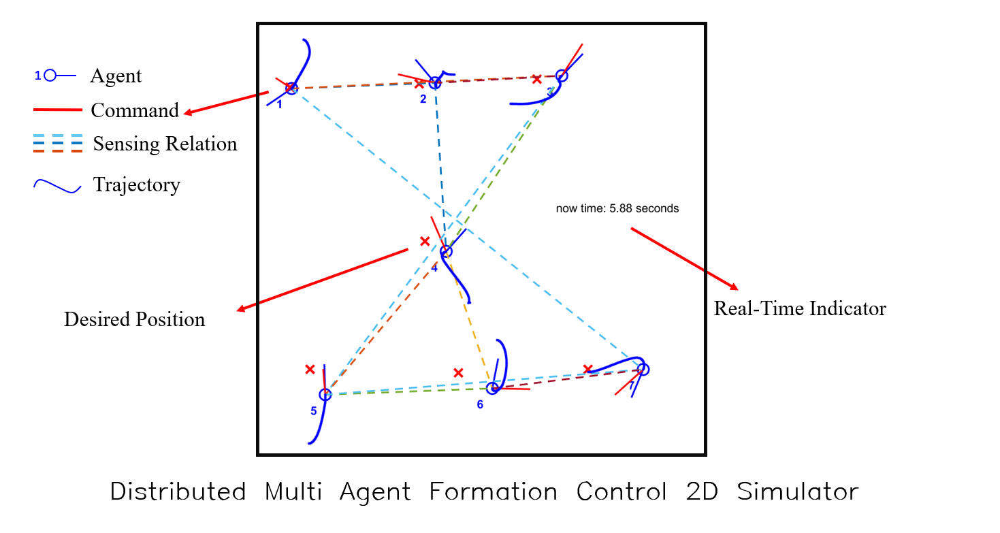

# Distibuted Multi-Agent Formation Controller based on Laplace Matrix
A distributed multi-agent formation controller and corresponding simulation base on [mobile robotics simulation toolbox](https://github.com/mathworks-robotics/mobile-robotics-simulation-toolbox) and Gazebo.

## Guidance

1. create a desired formation by manually selecting desired points.
```bash
 Create_Formation($xlimit,$ylimit)
```
- eg: `Create_Formation([-8,8],[-8,8])`
2. set parameters for visualization in `formation_single` file.

| Syntax      | If True |
| ----------- | ----------- |
| showTrajectory      | show xy trajectory   |
| showDesired   | show desired positions        |
| showConnection   | show sensing connections between agents        |
| showRealTime   | show real time indicator       |
| showCommand   | show [vx,vy] commands        |
| saveData   | save log data to workspace        |

3. start the simulation
```bash
formation_single
```
## Algorithm Introduction
TODO

## TurtleBot3 Simulation
we also create a package for distributed formation control based on [Turtlebot3](https://emanual.robotis.com/docs/en/platform/turtlebot3/simulation/#gazebo-simulation), an open source ROS standard platform robot. 

[Here]() is the git repository for gazebo simulation and algorithm implementation on TurtleBot3.